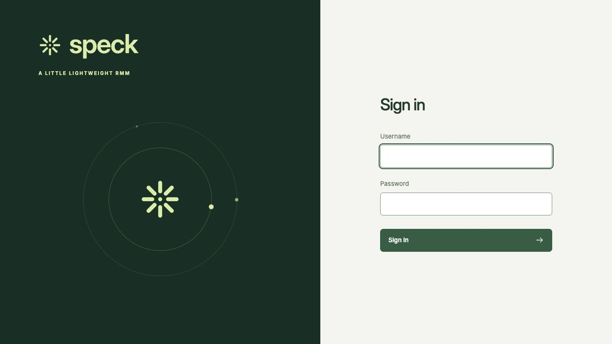
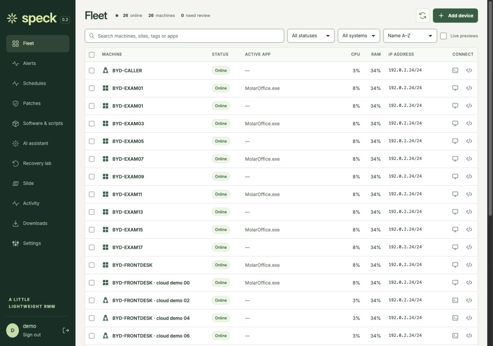

<picture>
  <source media="(prefers-color-scheme: dark)" srcset="brand/assets/speck-wordmark-lime.svg">
  
</picture>

**A LITTLE LIGHTWEIGHT RMM**

An open source RMM for Windows and Linux, with browser remote access and Slide
backup and recovery workflows. Speck is an early release for a single organization.

[Website](https://speckrmm.com) · [Screenshot gallery](docs/screenshots/README.md) ·
[Brand identity](brand/README.md) · [UI review](docs/ui-review.md) ·
[Operations guide](docs/operations.md) · [Management guide](docs/management.md) ·
[MVP review](docs/MVP-REVIEW.md) · [Desktop downloads](https://speckrmm.com/#downloads) ·
[iPhone & iPad](ios/README.md)

[](docs/screenshots/README.md)

| Fleet | Recovery lab |
| --- | --- |
| [](docs/screenshots/compact-fleet/desktop.jpg) | [](docs/screenshots/08-recovery.jpg) |

Gallery data is synthetic. See the [capture notes](docs/screenshots/README.md)
for provenance and the local preview workflow.

- Wide fleet table, right-side details drawer, direct screen and prompt actions.
- Services, CPU, memory, disks, active application, and host inventory.
- Persistent health/service/job alerts, acknowledgement and per-machine maintenance.
- Sites, tags, reversible retirement and clone-aware installation revocation.
- Scheduled patch scans and reviewed software/script templates with durable run history.
- Admin/operator/viewer accounts, [passkey sign-in](docs/passkeys.md), optional authenticator MFA and searchable audit history.
- Opt-in live screen previews, expiring automatically and disabled per device.
- Native Windows Update/apt/dnf inventory and reviewed update installation.
- Bulk software deployment with versioned, parameterized templates and results.
- OpenAI script assistance and reviewed computer-use proposals.
- Full-frame browser remote workspaces and macOS/Windows/Linux desktop clients
  with opt-in shared clipboard and remote key macros.
- Network interfaces, IPs, routes, DNS, traffic counters, sockets, process IDs,
  and on-demand ping, DNS, TCP and traceroute checks.
- Windows PowerShell and Linux shell commands, with job history and bounded output.
- File browsing and SHA-256-verified uploads/downloads, up to 256 MiB per file.
- Browser RDP with speaker output and microphone input; browser SSH and VNC.
- Slide inventory, backups, snapshot verification, isolated recovery networks,
  multi-machine restores, and application checks with retained evidence.
- Restored machines register as separate candidates requiring operator approval.

## Remote access

Speck agents initiate HTTPS and WebSocket connections to the server. A session
opens a temporary relay to a service on the endpoint's loopback address. The
endpoint does not need an inbound Internet firewall rule. Apache Guacamole's
`guacd` runs on the server's loopback interface.

| Endpoint | Monitoring, files, commands | Browser access | Active application |
| --- | --- | --- | --- |
| Windows amd64 | Windows service; PowerShell | RDP desktop and audio; optional VNC | Unprivileged helper in each signed-in session |
| Linux amd64/arm64 | systemd service; `/bin/sh`; optional `pwsh` | SSH; RDP/VNC when a desktop service is installed | X11 helper and `xprop`; headless/Wayland reports unavailable |

RDP reconnects or creates a Windows session. Windows client editions can lock
the local console: this is not simultaneous console shadowing. The downloaded
native `.rdp` fallback requires a LAN/VPN route to the endpoint. VNC and SSH do
not carry desktop audio. Microphone input requires a compatible browser, user
permission, and an RDP server that permits audio capture. Linux RDP audio also
requires the desktop's audio redirection modules.

## Development

Requirements: Python 3.11+, [uv](https://docs.astral.sh/uv/), Go 1.24+, Node.js 22+.

```sh
uv sync
npm --prefix web ci
./scripts/build.sh
uv run pytest
uv run ruff check server
(cd agent && go test ./internal/agent) # Linux
```

Set these variables in your own environment. Use independently generated random
values for the password and encryption key; do not commit them.

```sh
export SPECK_ORIGIN=http://localhost:8088
export SPECK_ADMIN_USERNAME=admin
export SPECK_BOOTSTRAP_PASSWORD='<random password, at least 16 characters>'
export SPECK_ENCRYPTION_KEY='<random key, at least 32 characters>'
export PYTHONPATH=server
uv run uvicorn speck.main:app --host 127.0.0.1 --port 8088
```

Agents require HTTPS. For remote-access development, also run Guacamole 1.6.0
with port 4822 bound only to loopback. See [deployment](docs/deployment.md).

## Recovery tests

1. Connect an account-scoped Slide API token in Settings.
2. Link each Speck device to its Slide agent ID in the device's details.
3. Create a recovery plan with baseline and recovery commands for each member.
4. Start a test. Speck captures the baseline, requests fresh backups, waits for
   snapshots at the target appliances, creates an isolated shared network, and
   requests restored VMs.
5. Review and approve the newly discovered instances. Match each source to its
   restored instance and run application checks.
6. Inspect the report. Stop the run's restored VMs when finished; snapshots,
   networks, VMs and evidence are retained.

A VM booting is not an application pass. Proof commands must exit successfully;
when comparison is enabled, their complete standard output must match. Use
stable JSON, database integrity checks, and content hashes. Recovery commands
can prepare the restored application's network configuration before checking it.

Runs are journaled. A server restart marks unfinished work as needing attention.
A provider write with an uncertain result is not retried automatically. Inspect
Slide and reconcile its state before starting another run. There is no automatic
cleanup or scheduled testing in this release. See [recovery design](docs/recovery.md).

## Project layout

```text
agent/       Go Windows/Linux services and desktop observer
server/      FastAPI control plane, authentication, jobs, remote relay, Slide
web/         TypeScript console
desktop/     Electron operator client for macOS, Windows and Linux
installers/  Windows and Linux enrollment installers
scripts/     Build and optional AustinLand deployment helpers
deploy/      systemd, Caddy and dedicated-host firewall configuration
brand/       Identity guide, shared tokens, SVG/PNG/ICO assets and licensed font
docs/        Deployment, security, recovery and screenshot gallery
```

Speck code is MIT licensed. Apache Guacamole is Apache-2.0 licensed and is used
as a separate gateway dependency. See [third-party notices](THIRD_PARTY_NOTICES.md).
