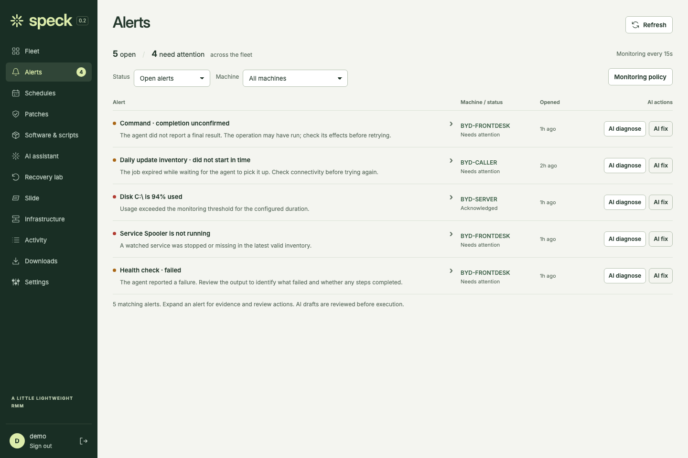
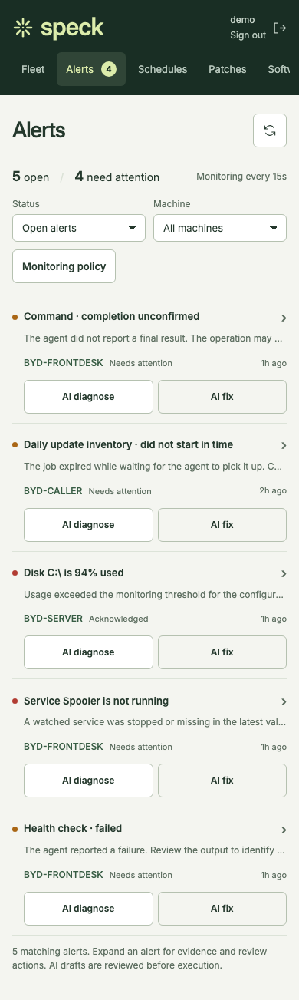
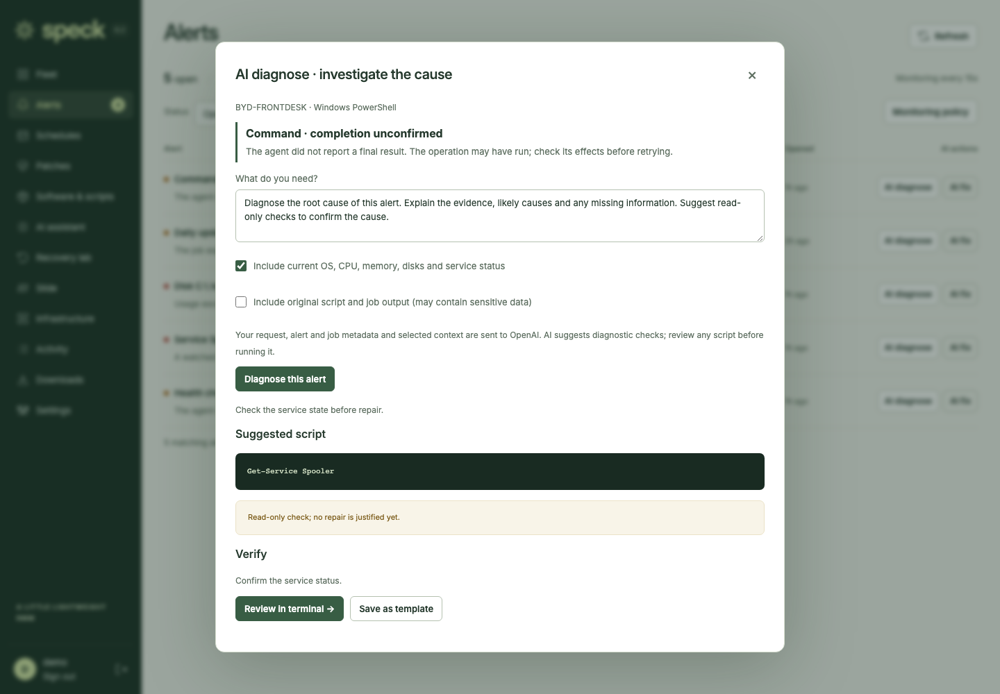
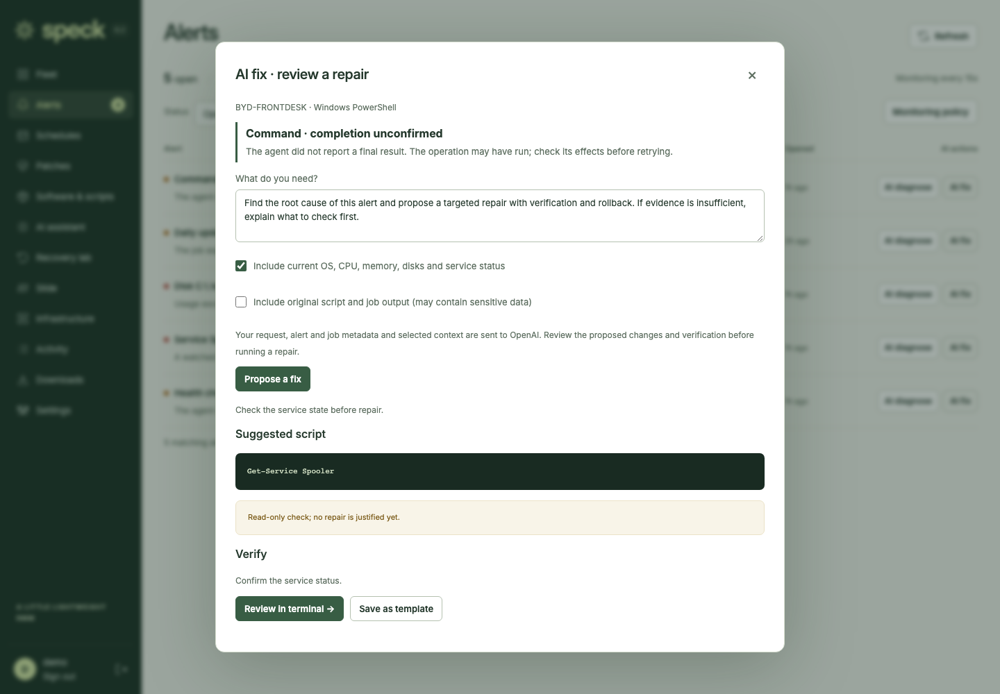

# Compact alerts and AI assistance — September 23, 2026

Local implementation; not deployed. Runtime source `03dbdb8`, preserving the live
Fleet toolbar release `1158014` / record `6faaf5c`. These are unretouched browser
captures of the real built frontend with synthetic alert fixtures and stubbed AI
responses. They demonstrate layout and review flow, not real diagnosis quality.
No provider requests or endpoint commands were performed.

| Desktop triage | Phone triage |
| --- | --- |
| [](alerts-desktop.png) | [](alerts-phone.png) |

| Diagnosis draft | Repair review |
| --- | --- |
| [](ai-diagnose.png) | [](ai-fix.png) |

The repair fixture intentionally returns a diagnostic check because an unconfirmed
job alone does not justify repeating changes. The UI preserves cautions and
verification when transferring a proposed script to the terminal for explicit run.

Dimensions, source and SHA-256 hashes are in [manifest.json](manifest.json).

Regenerate after a web build with:

```sh
SPECK_ALERT_SCREENSHOTS=../output/alerts-ai/screenshots npm run test:ui --prefix web -- alerts.spec.mjs
```

The suite covers Chromium and WebKit, desktop/tablet/320–390px phone views,
expanded evidence, safe text rendering, filters and review actions, viewer
restrictions, provider failure, offline messaging, opt-in job context and the
correct-machine terminal handoff without automatic execution.
