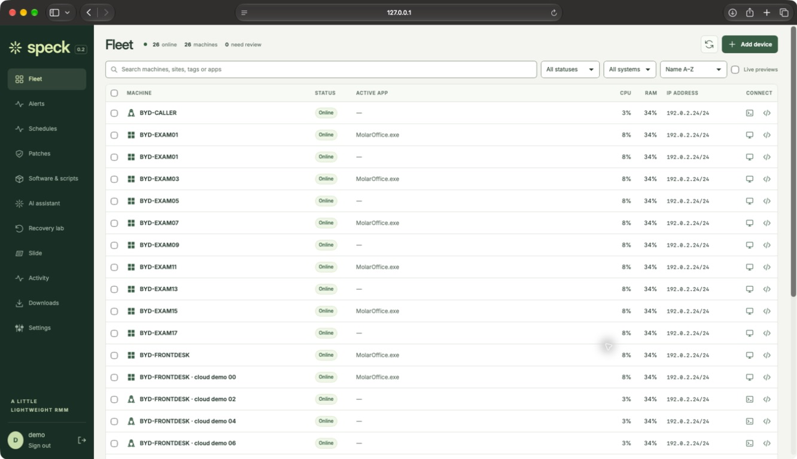
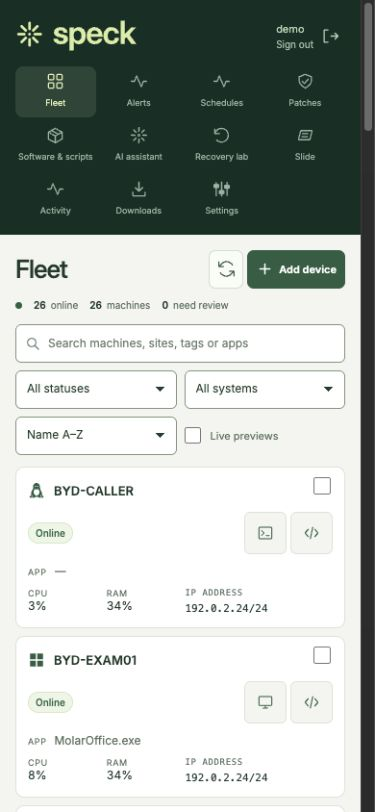
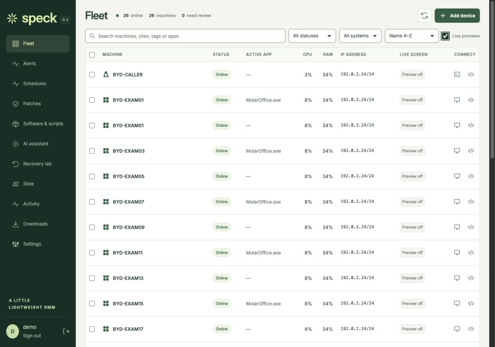

# Compact Fleet

Unretouched captures of the actual Speck frontend with synthetic dental machines
and documentation-only IP addresses, September 22, 2026. No production inventory,
credentials or patient records are included. [Capture manifest](manifest.json).

| Desktop | Native Safari |
| --- | --- |
|  |  |

| Mobile | Optional previews |
| --- | --- |
|  |  |

Browser viewport targets were 1280×900 and 390×844; original returned image
sizes are recorded in the manifest. Preview frames are disabled in this fixture.
Long names and additional synthetic endpoints exercise density and truncation.
See [behavior and validation](../../operations/compact-fleet.md).
