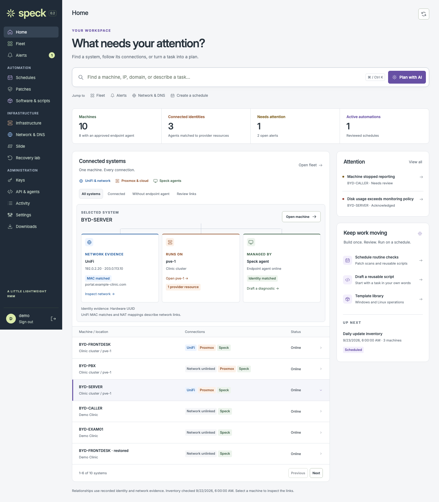

# Connected Home

Actual built console captured in Chromium with synthetic agent, Proxmox and UniFi
fixtures. No production inventory, credentials or private session data appears.
The image files are unretouched; their dimensions and SHA-256 digests are recorded
in [manifest.json](manifest.json). Fixed mobile navigation appears at its viewport
position inside the full-page capture.

[Behavior, review flows and validation limits](../../operations/connected-workspace.md).

| Layout | Capture |
| --- | --- |
| Desktop, 1440 px | [Home and selected relationships](home-1440.png) |
| Tablet, 834 px | [Labeled rail and connected systems](home-834.png) |
| Phone, 390 px | [Stacked relationships and automation](home-390.png) |
| Narrow phone, 320 px | [Compact Home](home-320.png) |

Reproduce with `SPECK_HOME_SCREENSHOTS=../output/connected-workspace npm run
test:ui --prefix web -- home.spec.mjs` after building the console. For an
interactive version, run `.venv/bin/python scripts/preview.py --connected --port 8743`
and use any nonempty demo sign-in values at `http://127.0.0.1:8743`.
