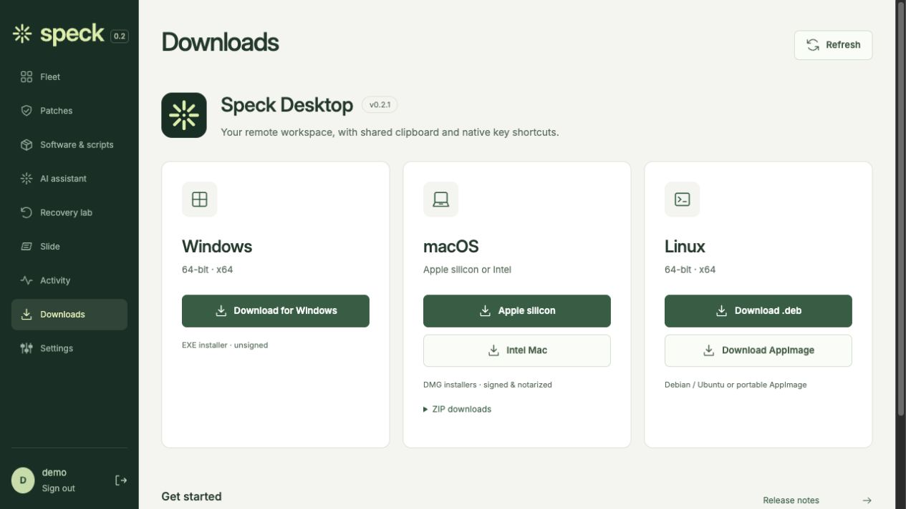
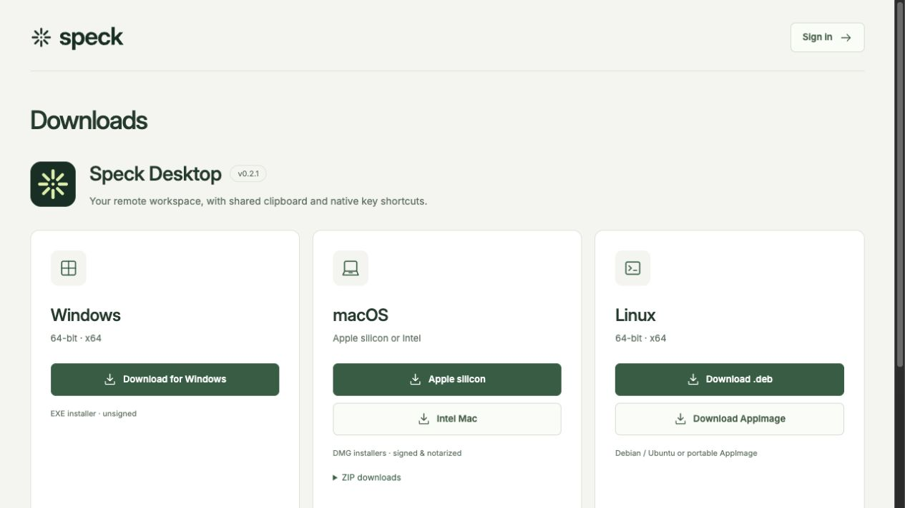
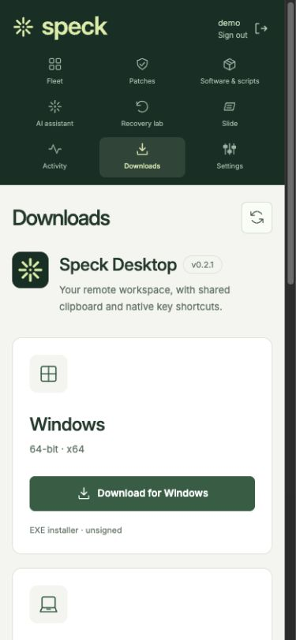
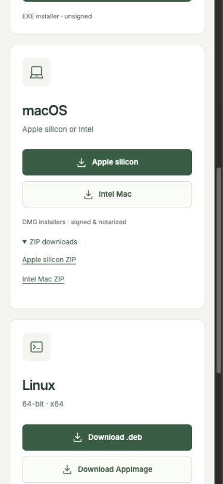
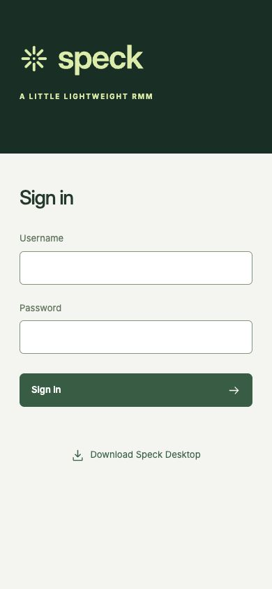

# Desktop downloads

The Downloads page links directly to the published Speck Desktop 0.2.1 installers:
Windows x64, macOS Apple silicon and Intel, and Linux x64 (.deb / AppImage).
It is reachable from the sidebar, Settings, desktop handoff, and the sign-in page.
The public route is [speckrmm.com/#downloads](https://speckrmm.com/#downloads).

These are original, unretouched browser captures of the built frontend using
`scripts/preview.py`. The signed-in account is synthetic. No managed machine,
private account, credential, or remote-session content appears in the captures.
Original-byte digests and image dimensions are in [manifest.json](manifest.json).

| In the console | Before sign-in |
| --- | --- |
|  |  |

| Mobile navigation | Mac and Linux installers | Sign-in |
| --- | --- | --- |
|  |  |  |

Verified the desktop and 390-pixel mobile layouts, 46-pixel primary download
buttons, alternate Mac ZIP links, Settings round trip, sign-out/download routing,
and public deep link. All seven installers and SHA256SUMS return HTTP 200 with
attachment headers. TypeScript and the production Vite build pass.

The platform catalog is kept in `web/src/downloads.ts`. Advance its version only
after every linked installer and checksum is available on the published release.
Installer execution qualification remains in [desktop-quality.md](../../desktop-quality.md).
