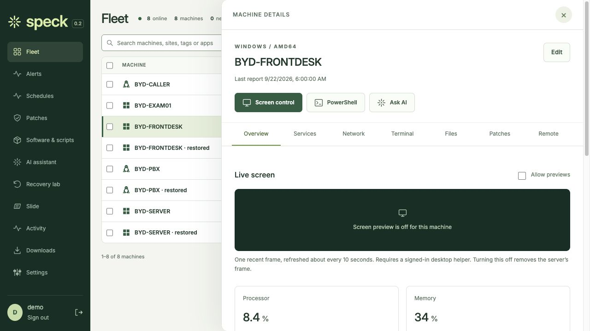
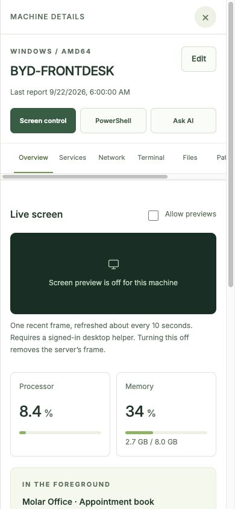

# Fleet row and machine pane

Click a row to open the machine pane. The active row stays highlighted, and other
visible rows can be opened directly. The pane has a 180 ms entrance animation and
no backdrop. Reduced-motion settings disable the animation. Mobile uses a full-width
pane and keeps the underlying fleet still while it is open.

Original, unretouched captures of the real frontend with local synthetic data.
See the [capture manifest](manifest.json) for dimensions and hashes.

## Desktop context

## Mobile pane

