# Speck for iPhone and iPad

Unretouched screenshots of the native SwiftUI app, captured with Apple XCTest on
iPhone 18 Pro and iPad Pro 13-inch simulators running iOS/iPadOS 27. The app supports
18 and later; older OS versions have not yet been exercised. Fleet, alerts, jobs
and recovery content use the synthetic dental-office fixtures. Sign-in is empty.
No live inventory, credentials or patient data appear here.

## iPhone

| Fleet | Machine | Script editor |
| --- | --- | --- |
| [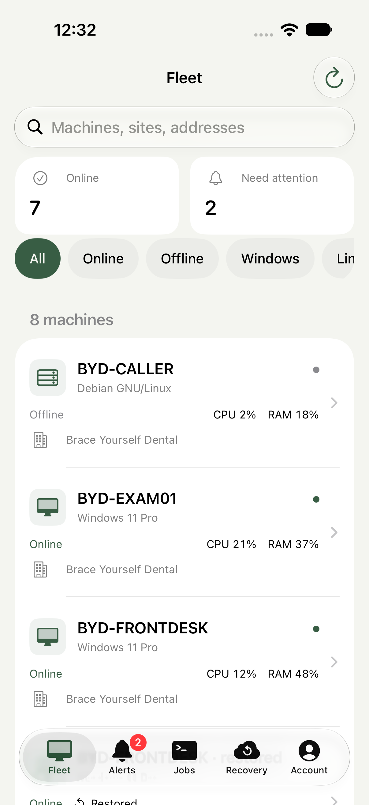](iphone-fleet.png) | [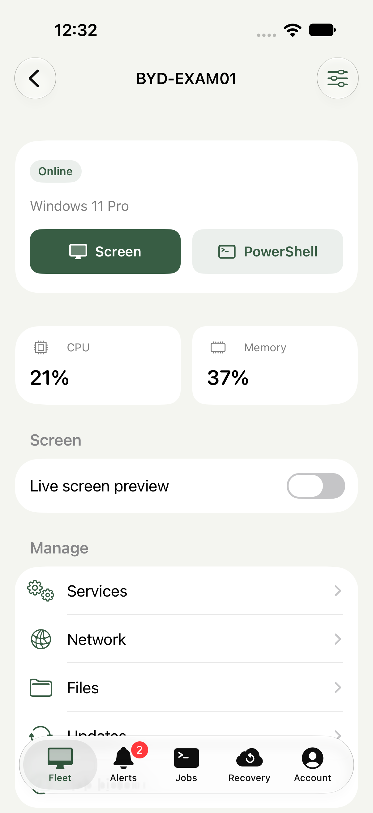](iphone-machine.png) | [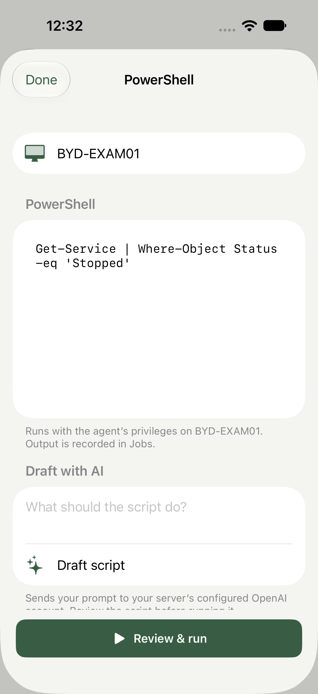](iphone-command.png) |

| Sign-in | Alerts | Recovery |
| --- | --- | --- |
| [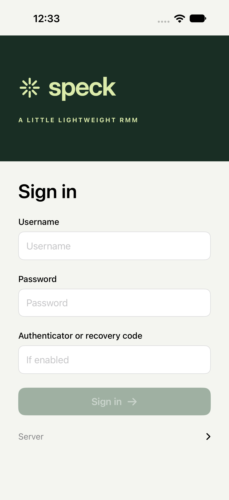](iphone-sign-in.png) | [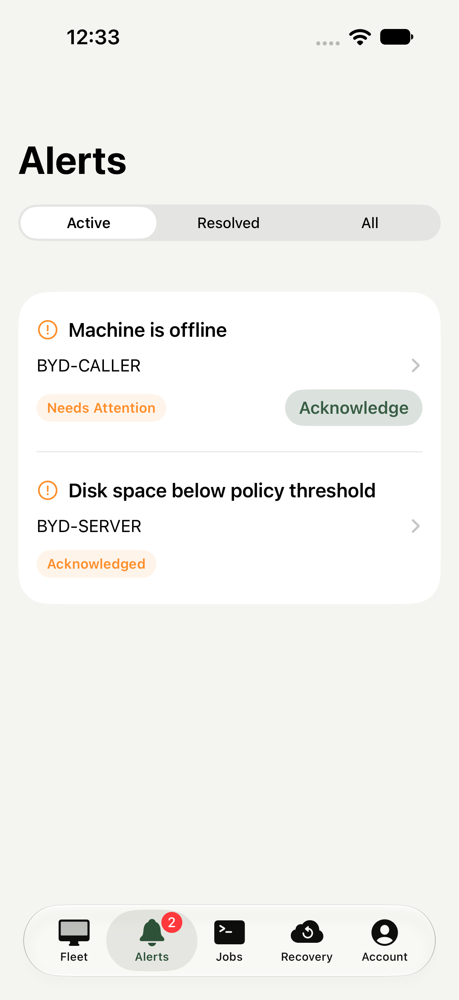](iphone-alerts.png) | [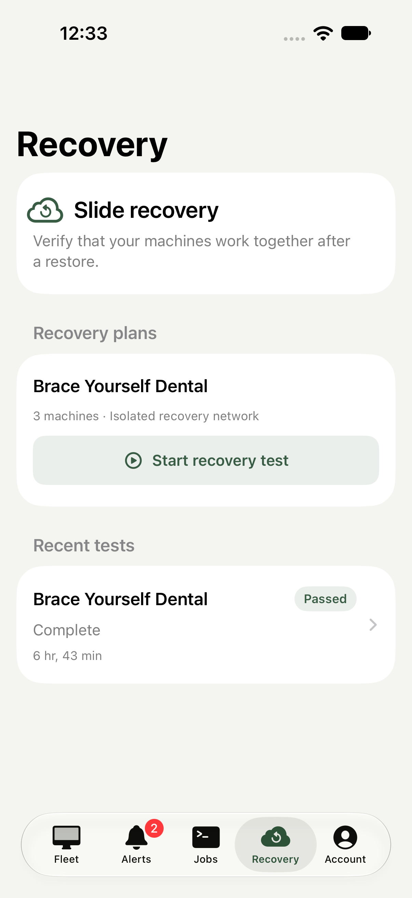](iphone-recovery.png) |

## iPad

[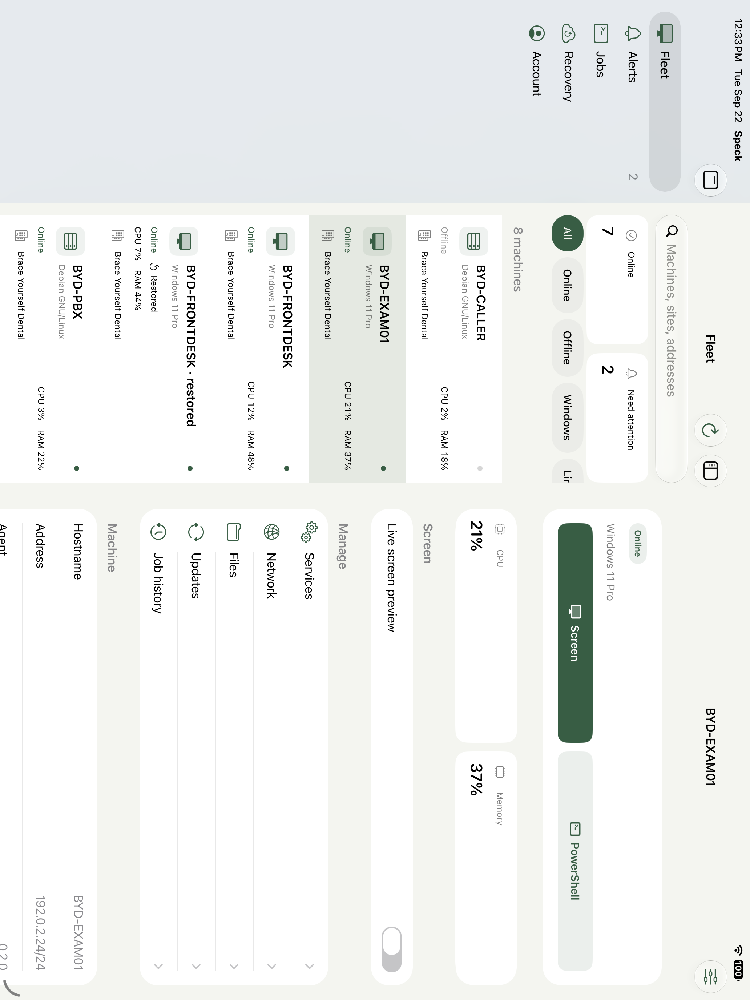](ipad-machine-landscape.png)

| Fleet and details | Script editor |
| --- | --- |
| [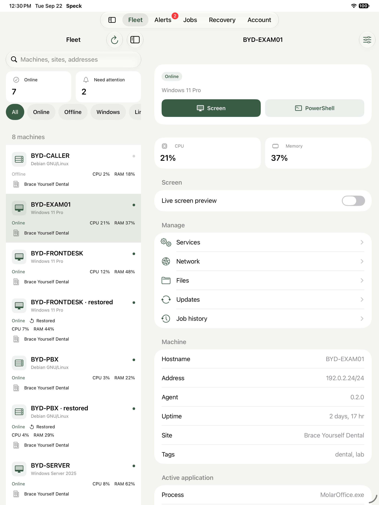](ipad-machine.png) | [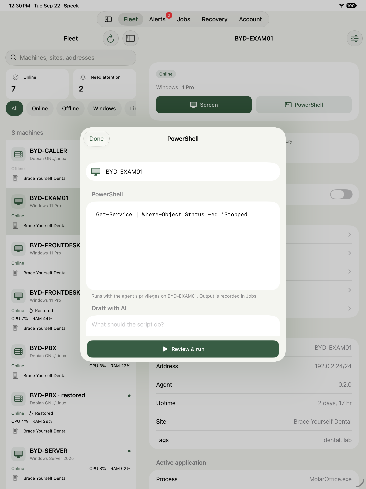](ipad-command.png) |

## Dark appearance and larger text

| iPhone dark | iPhone larger text | iPad dark |
| --- | --- | --- |
| [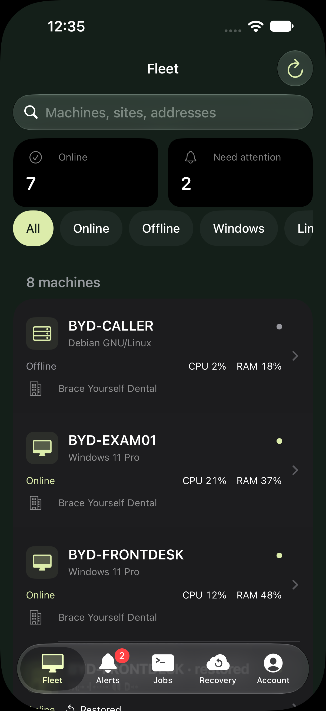](iphone-machine-dark.png) | [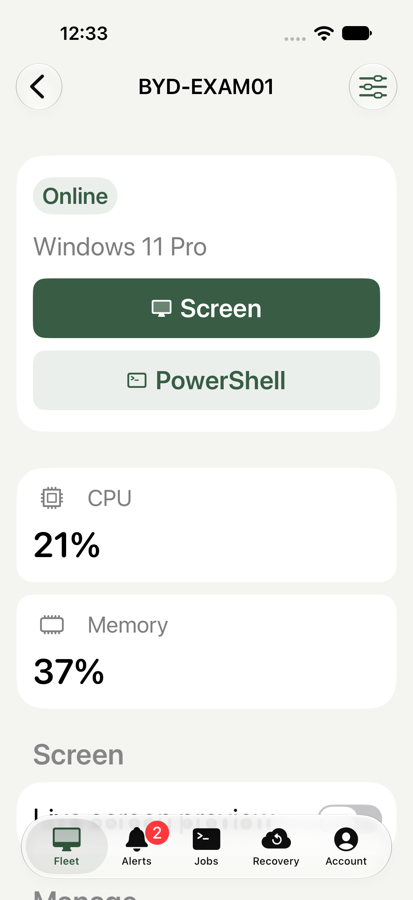](iphone-machine-large-text.png) | [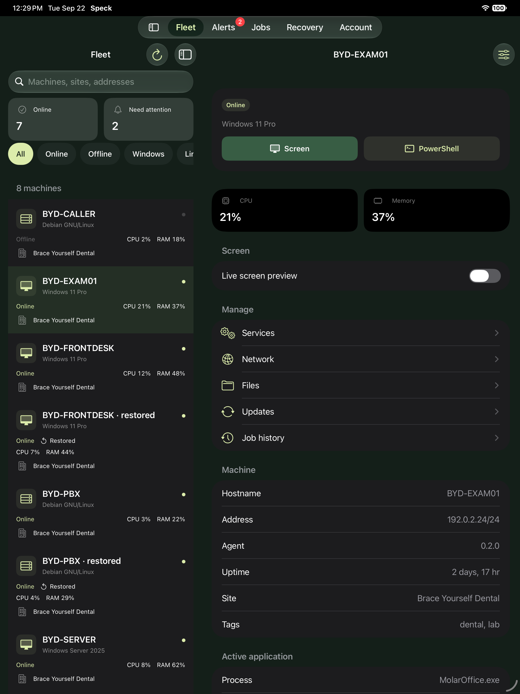](ipad-machine-dark.png) |

[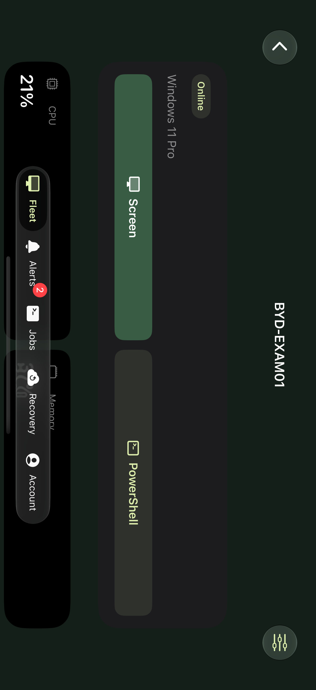](iphone-machine-landscape.png)

The [manifest](manifest.json) records all 28 files, dimensions, original-byte
SHA-256 digests and test provenance. Additional captures include services, search,
jobs and account on each device. Live RDP/SSH captures remain private.
See the [qualification report](../../ios-quality.md) for behavior tested and limits.
