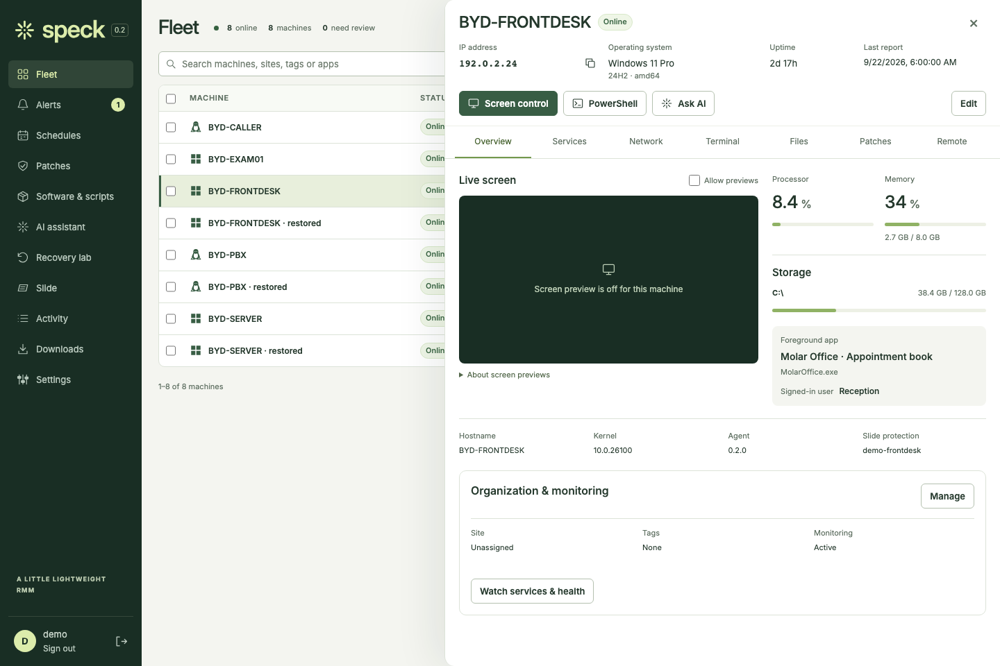
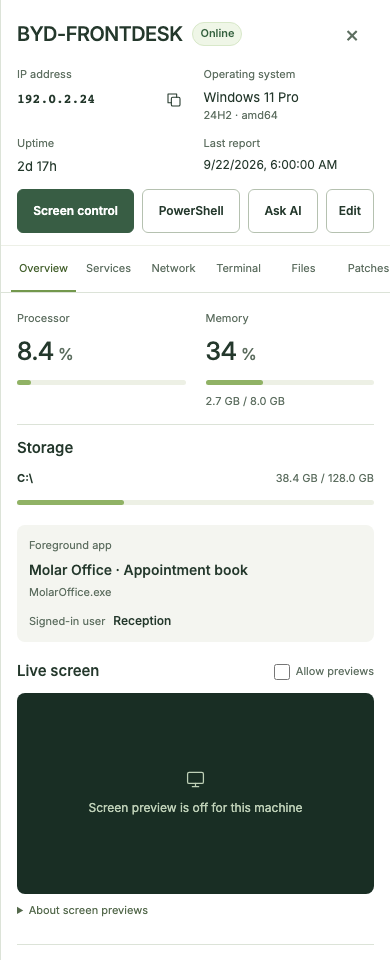
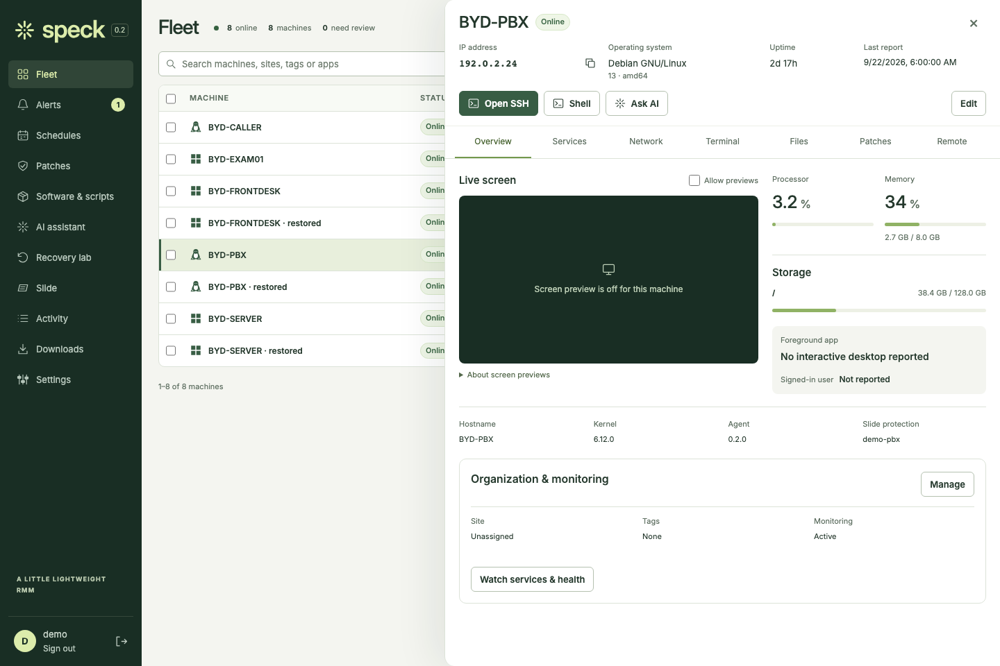
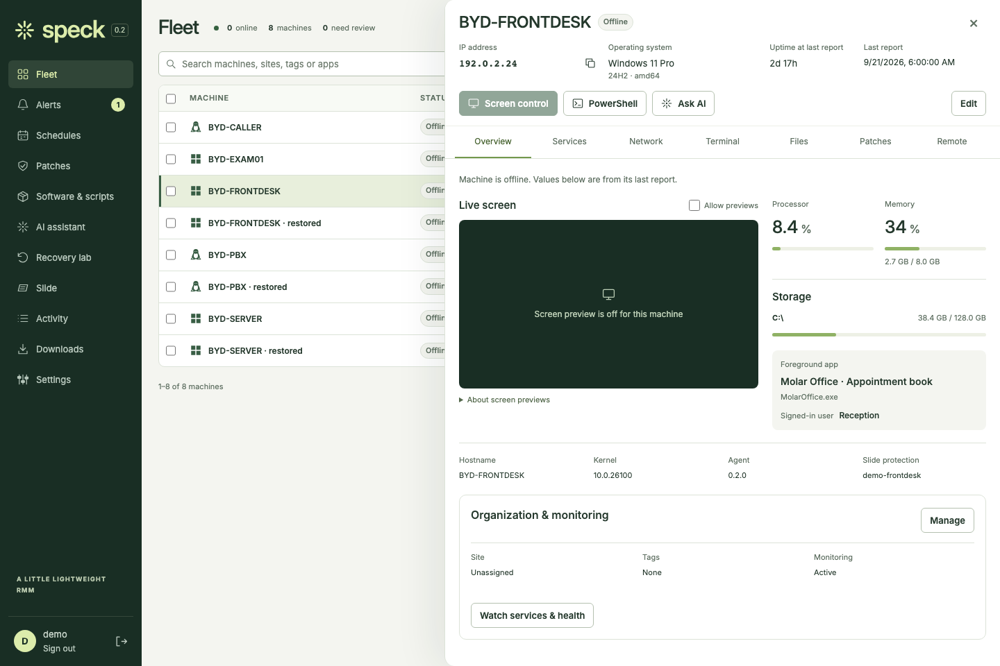

# Compact machine overview

Original, unretouched Chromium captures of the built console with synthetic data
from `scripts/preview.py`. No live machine, credential or remote session was used.
The offline capture overrides only online/report-time fixture fields. Dimensions,
browser version and SHA-256 digests are in [manifest.json](manifest.json).

The name and connection state share the pane heading. IP address, OS/version,
uptime and last report appear immediately below; the IP has a copy action.
A 16:9 preview sits beside CPU, memory, storage, foreground app and signed-in user.
Small screens put machine health before the preview. Missing telemetry is explicit.

## Desktop

## Mobile

## Linux

## Offline

