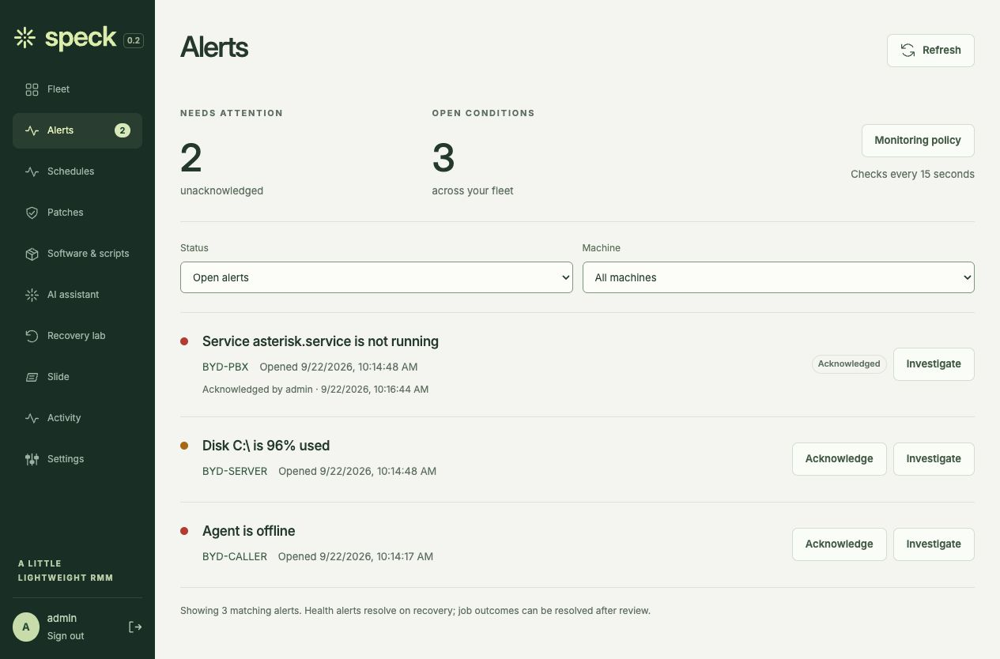
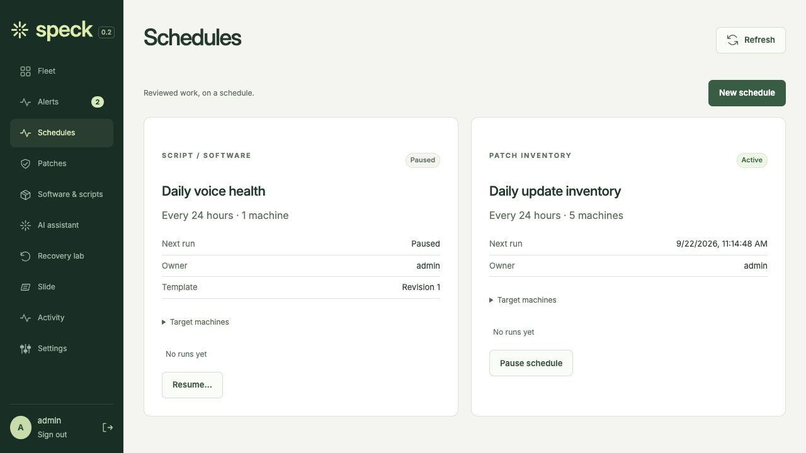
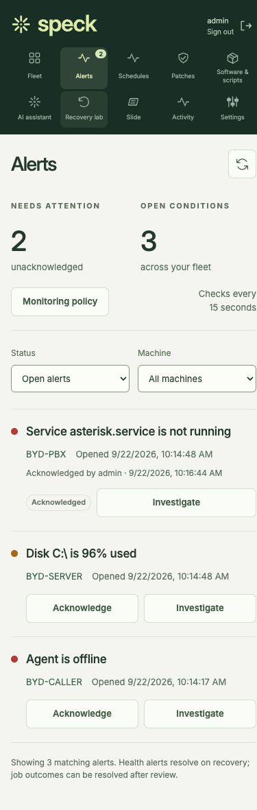
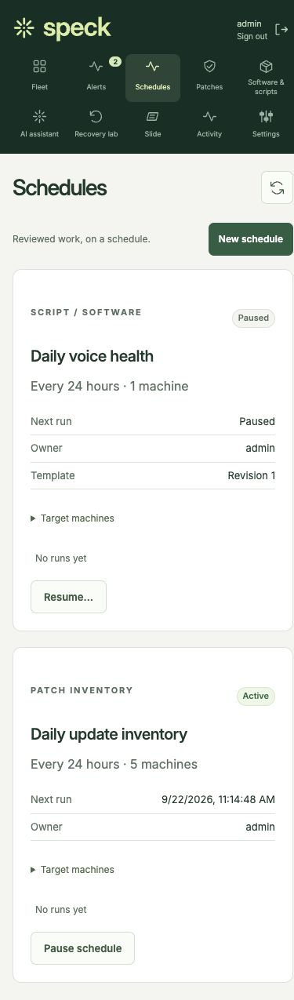
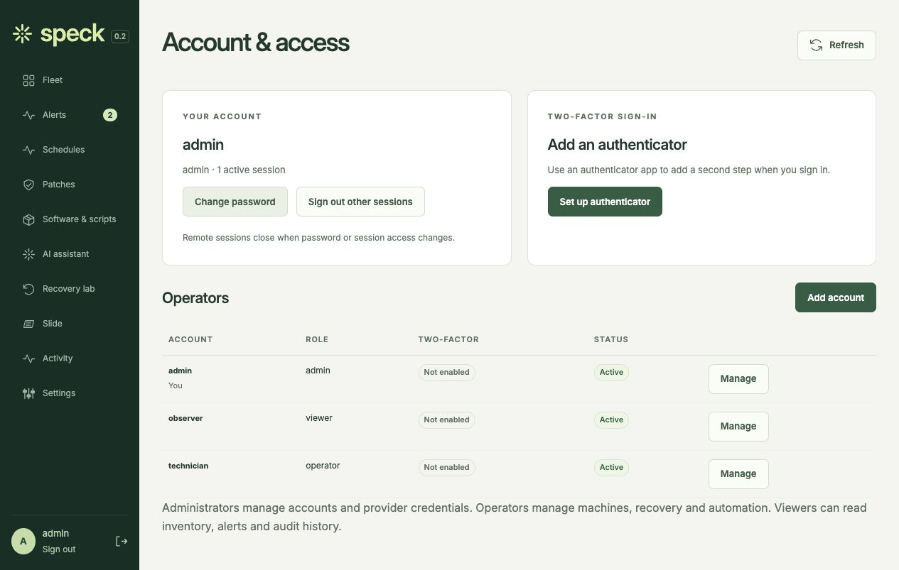
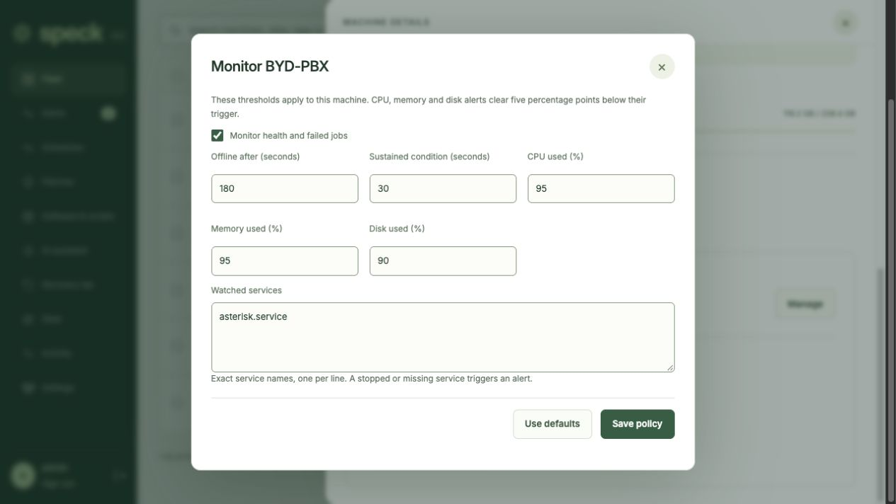
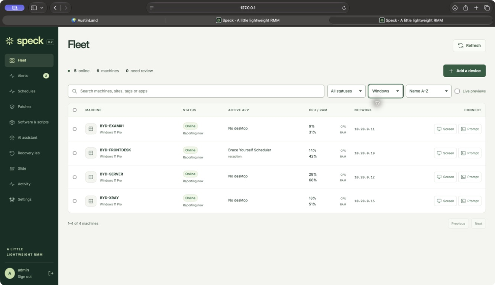

# Management review screenshots

Captured September 22, 2026 from the actual implementation in an isolated local
Speck server. Machines, telemetry and accounts are synthetic. These are UI evidence,
not proof of successful remote operations on real endpoints. Original PNG bytes are
retained; SHA-256 digests and sizes are in [manifest.json](manifest.json).

Desktop review used 1280×720; mobile review used 390×844. Full-page captures include
scrollable content beyond those viewport heights. No images were retouched.

| Alerts | Schedules |
| --- | --- |
|  |  |
|  |  |

Tested interactions: acknowledge an alert, create/review/pause a Linux health-check
schedule, filter audit history, open device policies and account controls, and sign
in as a viewer to verify management actions are absent. Two-factor cryptography,
code replay/recovery, permissions and revocation were tested through the backend
test suite; no real authenticator, operator credential or endpoint was changed.

## Safari select verification

Native Safari, September 22: branded closed controls, native option menus, mouse
selection and keyboard selection verified against the local synthetic fleet. The
live Windows remote toolbar was also visually checked after deployment; its select
height, colors and arrow now match the adjacent buttons. Native menu inspection
confirmed the repaired Ctrl + Alt + Del option. Remote screenshots remain private.
