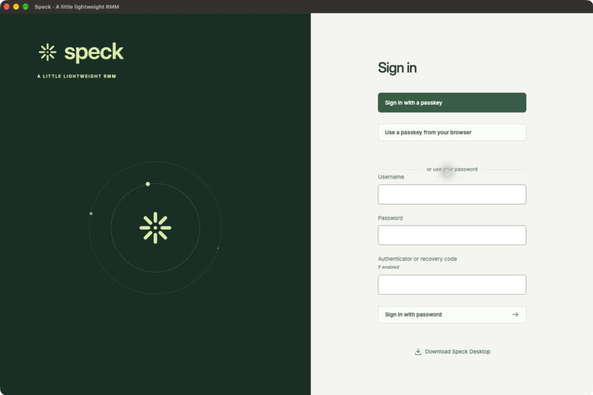
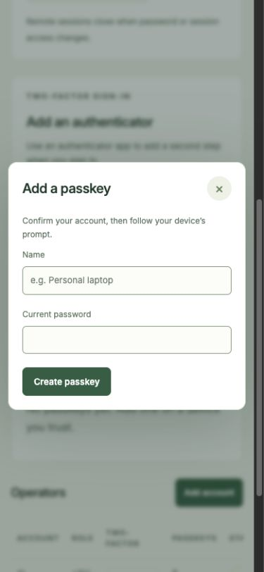
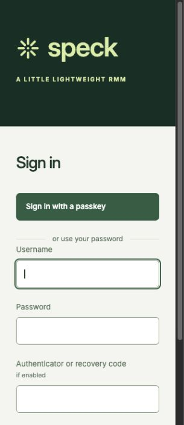
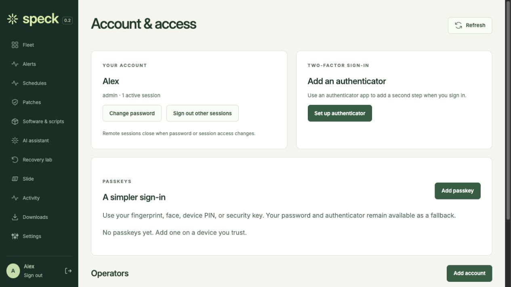
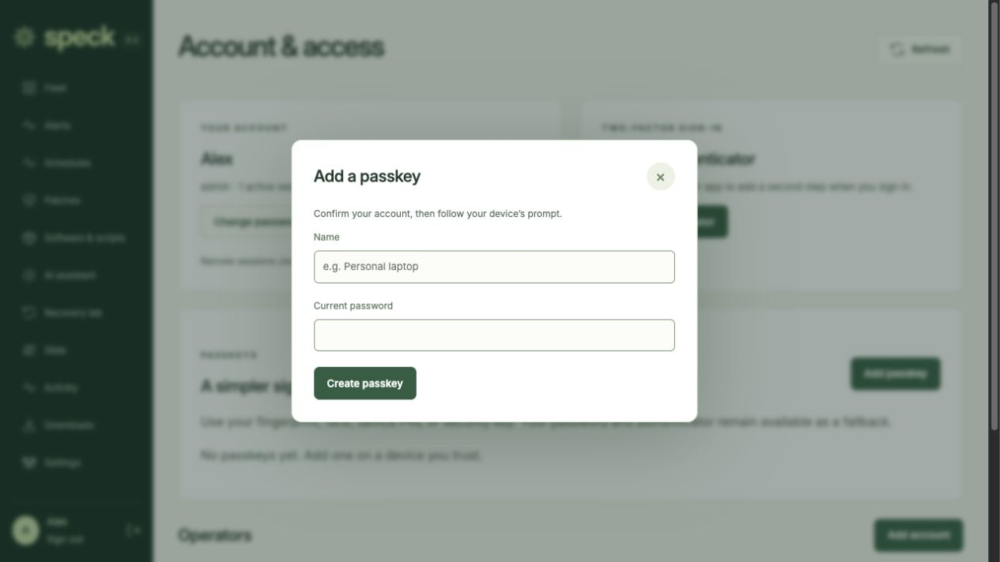
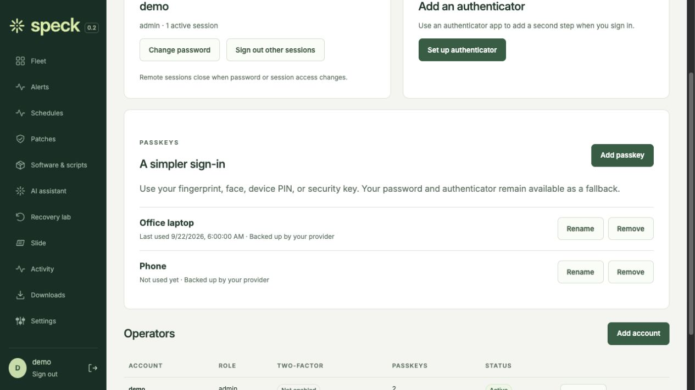
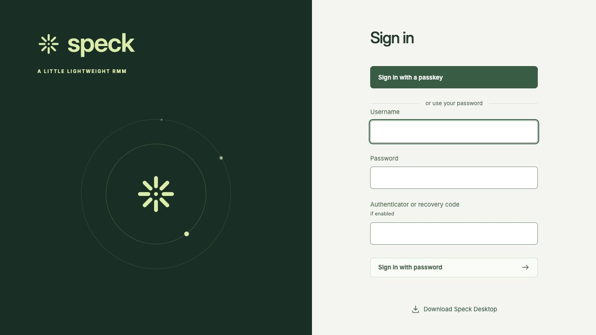

# Passkeys

Original, unretouched captures of the real frontend with synthetic local accounts,
and the signed Mac application on the public sign-in screen. No personal passkey,
credential, or private machine data appears. Dimensions and hashes are recorded in
[the manifest](manifest.json). These screenshots show UI quality, not a completed
physical biometric ceremony.

## Mac Signin

## Mobile Enrollment

## Mobile Signin

## Web Account

## Web Enrollment

## Web Keys

## Web Signin

