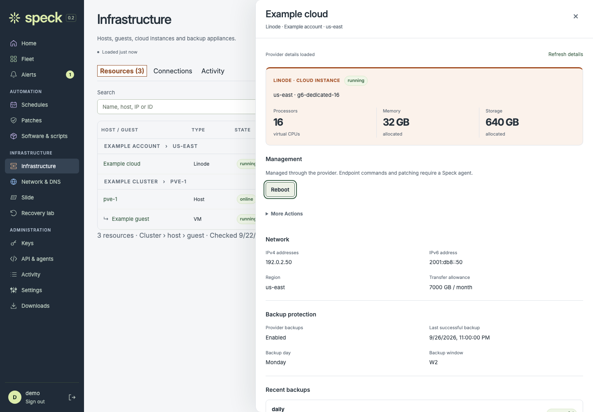
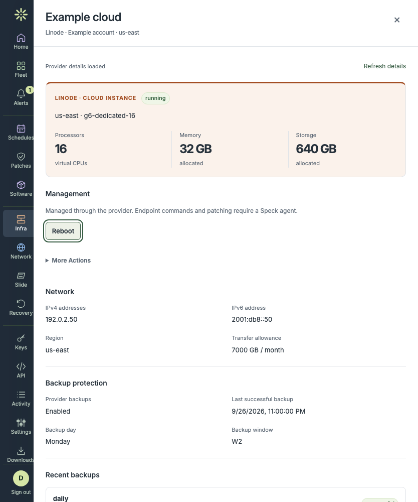
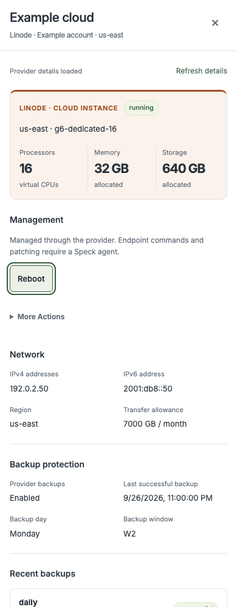
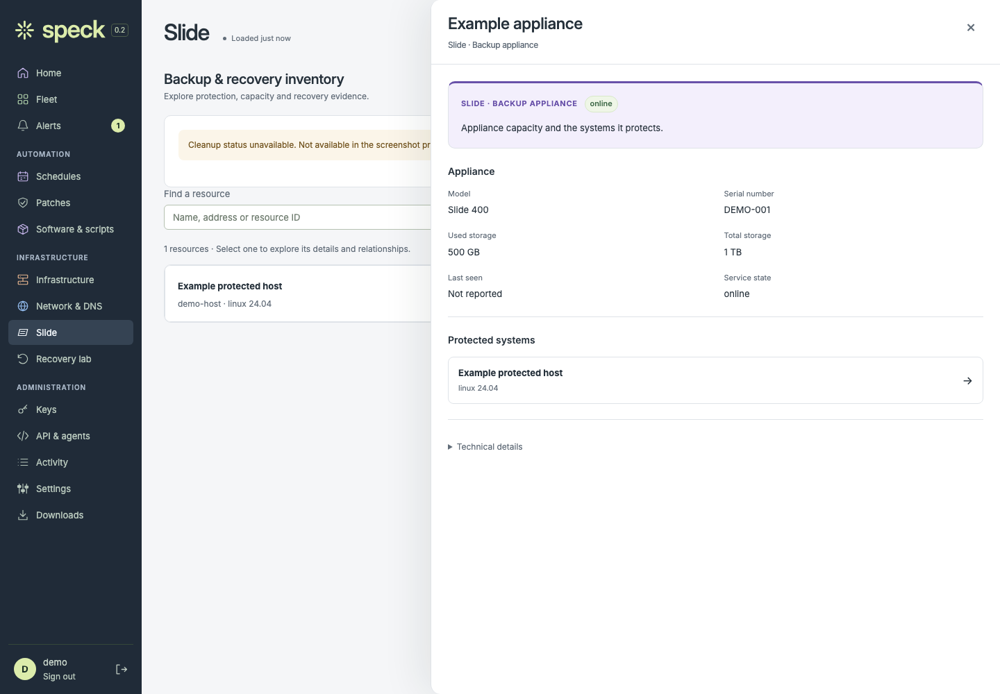
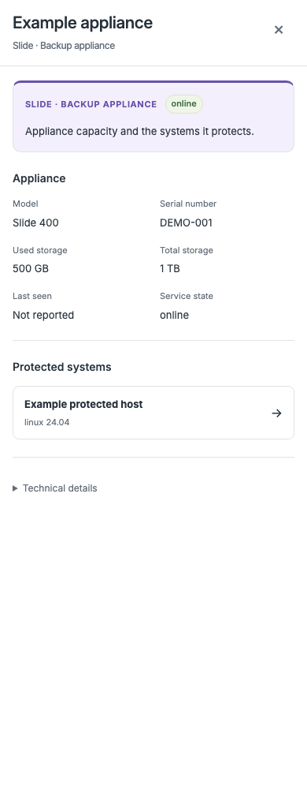

# Resource flyouts

Unretouched browser captures from `web/test/ui/resource-details.spec.mjs` against
the production web bundle and the loopback preview. Provider responses are
synthetic fixtures in that test: documentation IPs, example names and no keys or
customer data. The manifest records original PNG digests.

