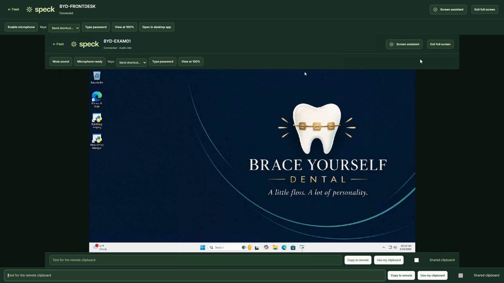
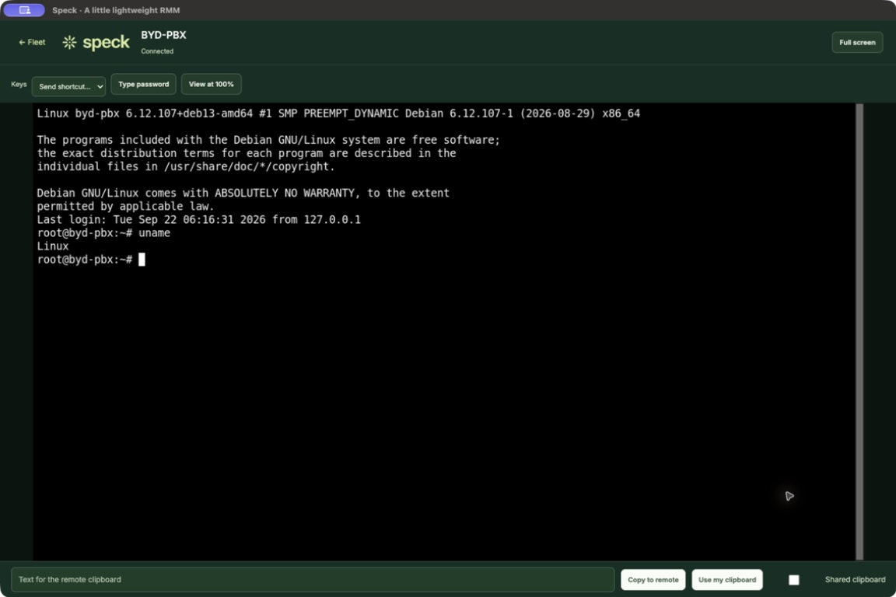

# Speck Desktop 0.2.1

Real native-client captures from the synthetic dental lab. The Mac image is an
unmodified native window capture of a Linux SSH command. The Windows image shows
the real native remote workspace, with synthetic microphone input armed.

See the [qualification matrix](../../desktop-quality.md) for verified behavior
and remaining limits. These supplement the [0.2 interface gallery](../v0.2/README.md).
