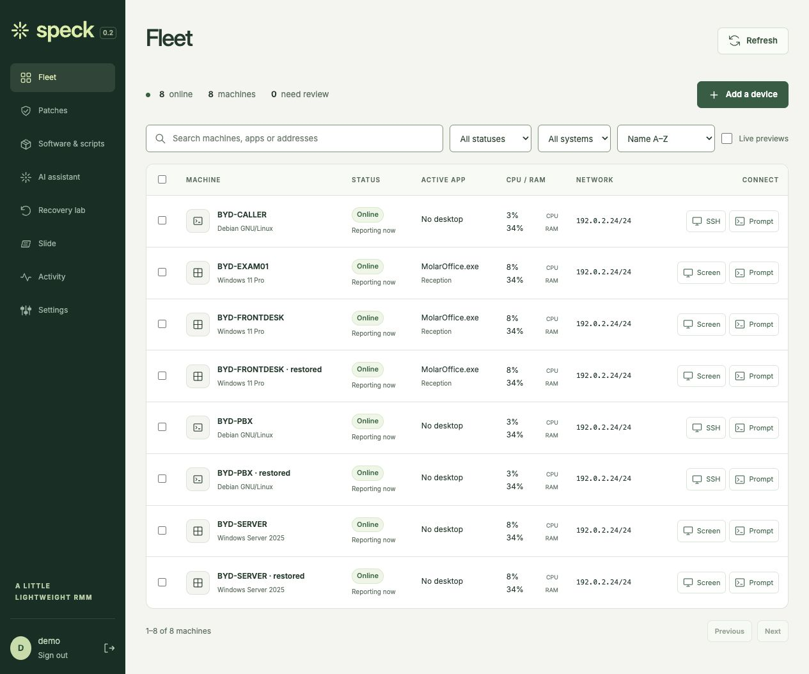
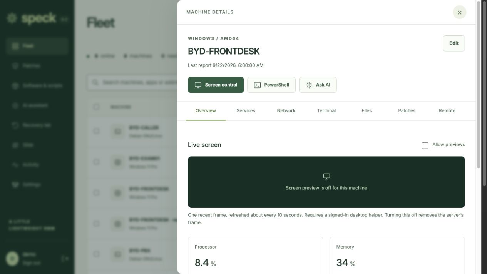
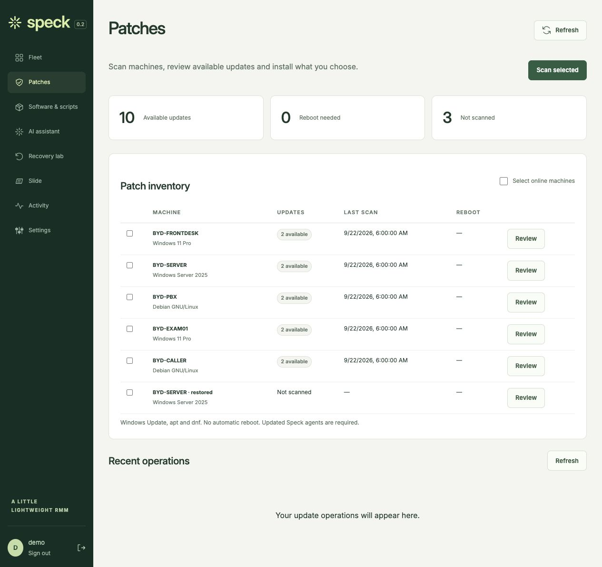
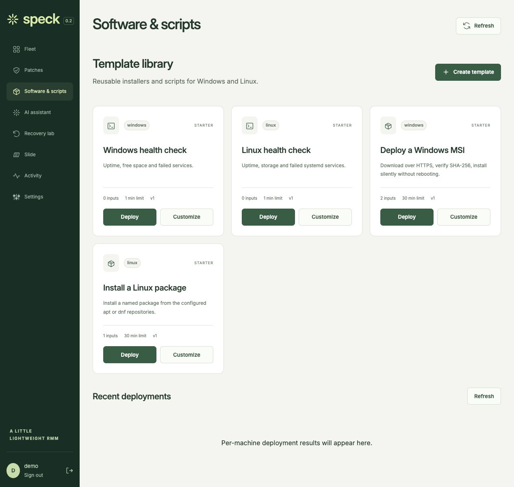
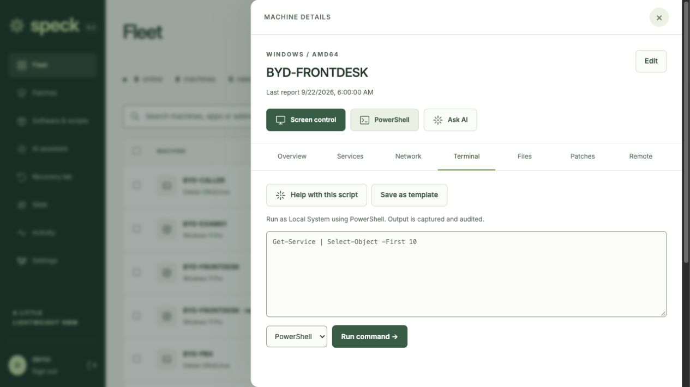
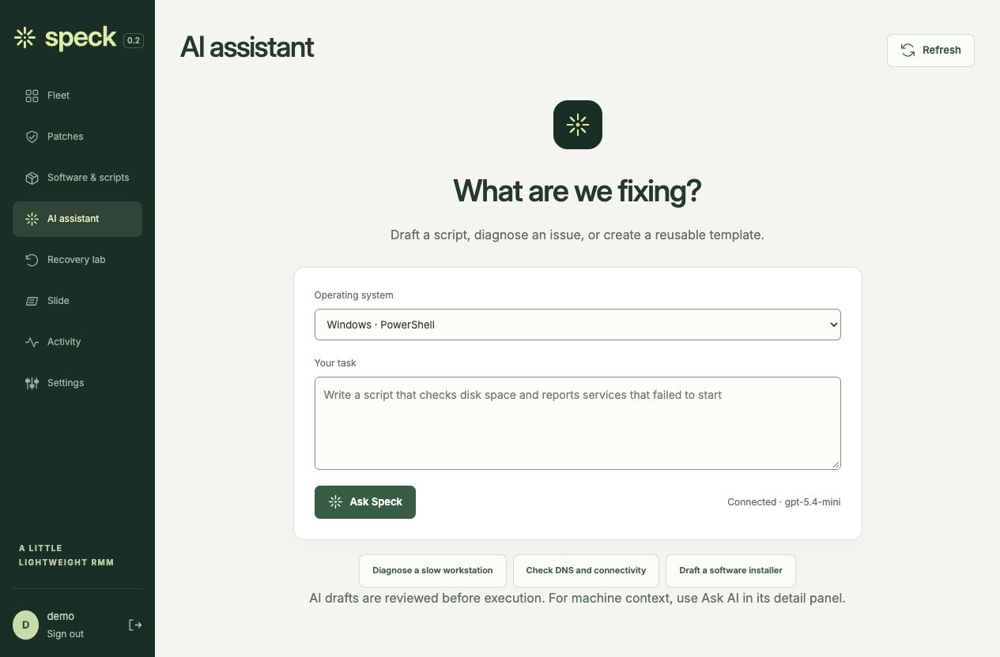
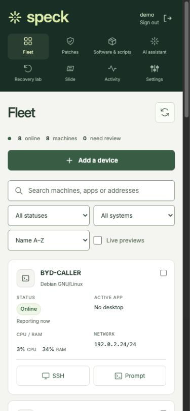
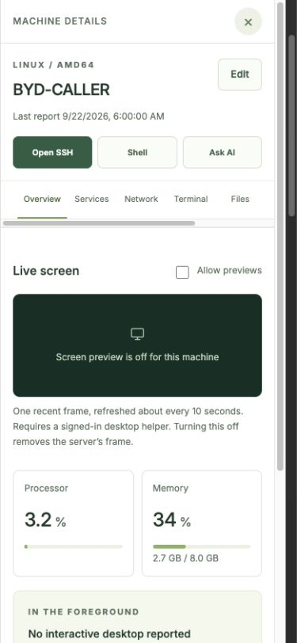
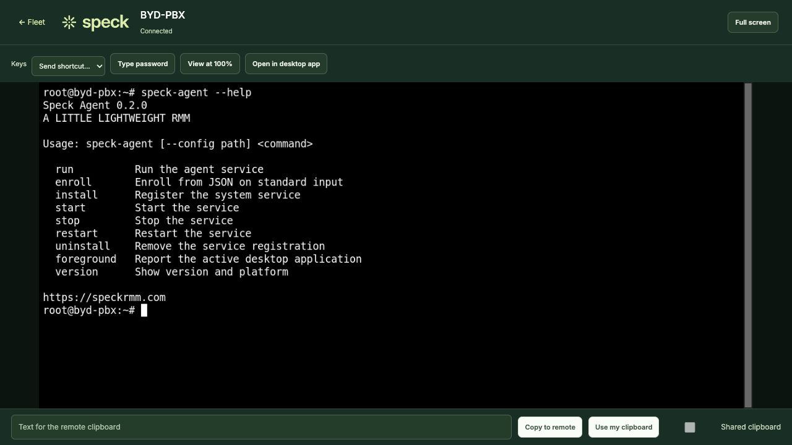

# Speck 0.2 interface

Unretouched browser captures of the real frontend, using synthetic preview data.
The Linux remote-workspace image is a real session in the isolated dental lab.
See `manifest.json` for dimensions, hashes and capture provenance.

| Fleet table | Device drawer |
| --- | --- |
|  |  |

| Patches | Software and scripts |
| --- | --- |
|  |  |

| PowerShell | AI assistant |
| --- | --- |
|  |  |

| Mobile fleet | Mobile details |
| --- | --- |
|  |  |

The sign-in capture freezes one moment of the orbit animation. Reduced-motion
preferences disable the animation. These images illustrate the interface;
verification results and remaining limits are in [the UI review](../../ui-review.md).
