# Visual audit — September 22, 2026

Unretouched screenshots from the actual frontend and SwiftUI app using synthetic
fixtures. Browser captures use WebKit at 1440, 834, 390 and 320 pixels; native
captures use iPhone 18 Pro and iPad Pro 13-inch simulators. No endpoint commands
or remote gateway sessions were started for these captures. The remote image
verifies control layout only.

The [audit](../../ui-review.md#shared-ui-and-native-audit--september-22-2026) records
coverage and limits; [manifest](manifest.json) records originals and checksums.

## Desktop Fleet and distinct navigation icons

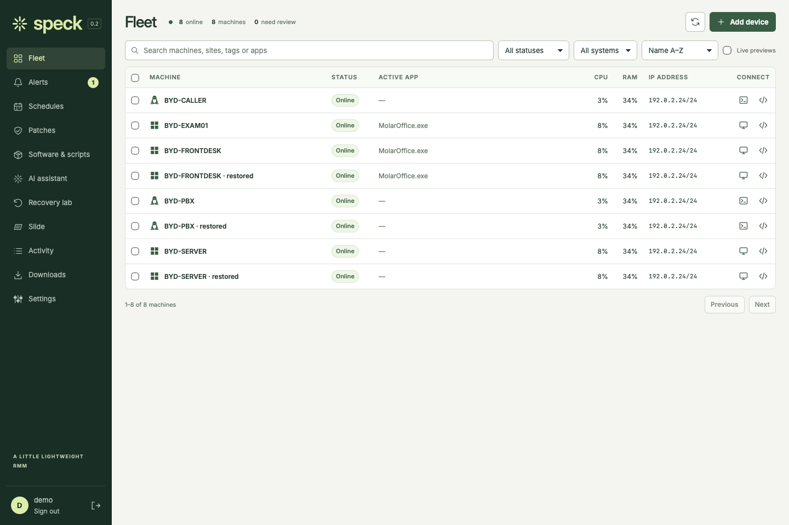

## Shared field and action sizing in Settings

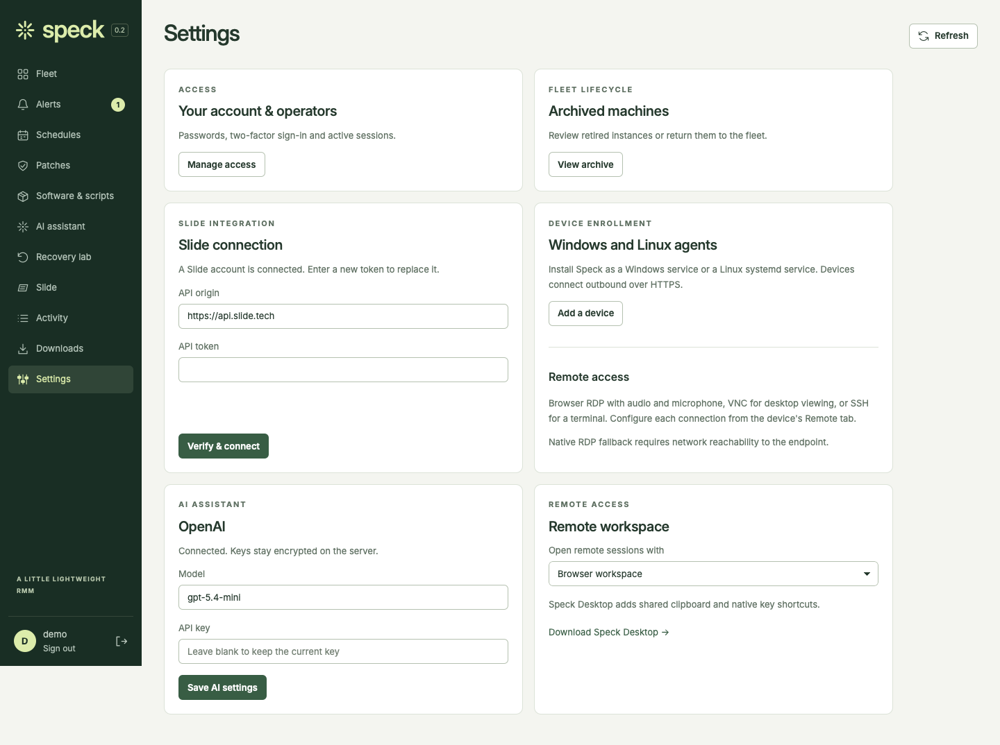

## Text-first software and script cards

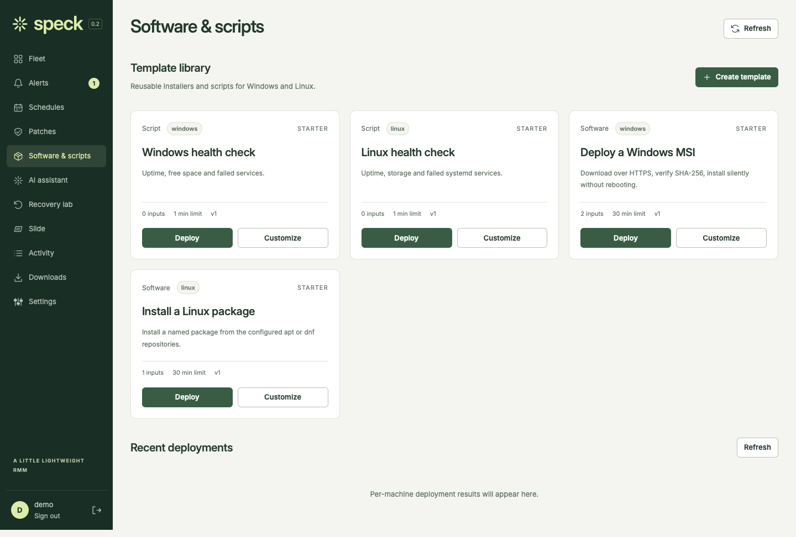

## Recovery with restrained status and action hierarchy

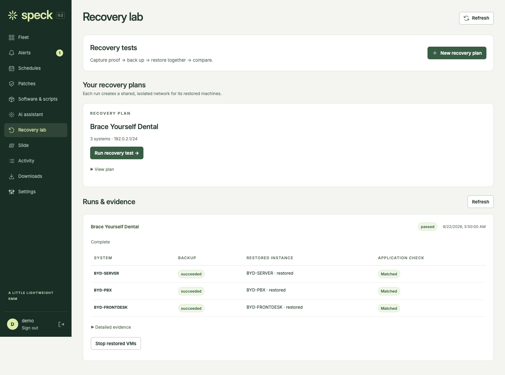

## Tablet account controls

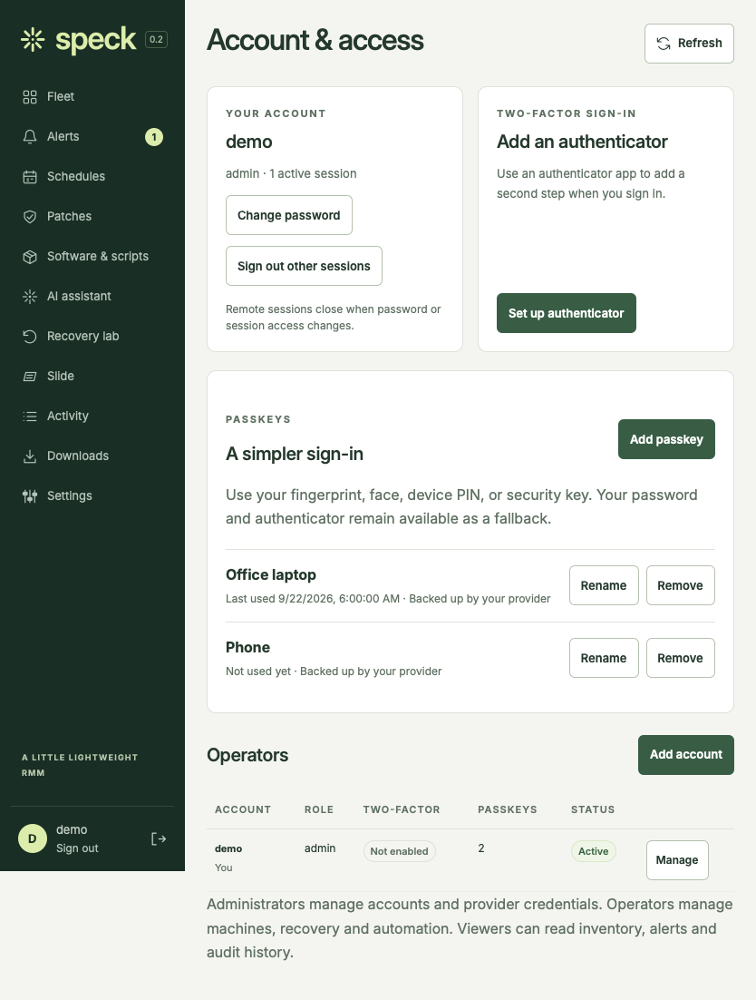

## Labeled mobile navigation and touch controls

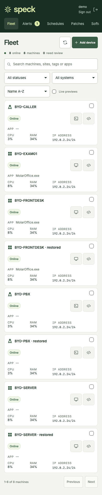

## Monitoring form at the narrowest tested width

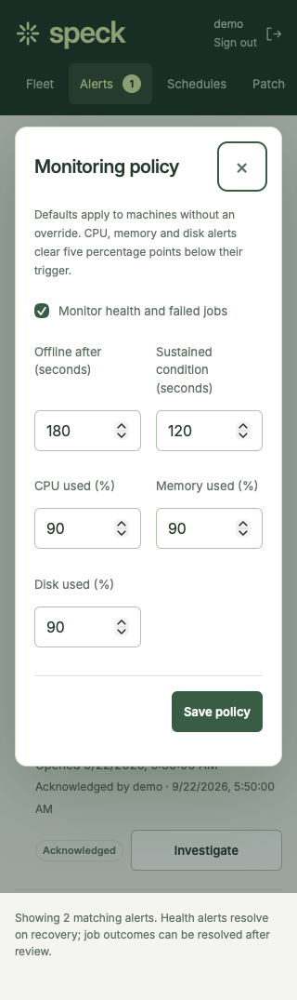

## Remote keyboard layout with a synthetic session

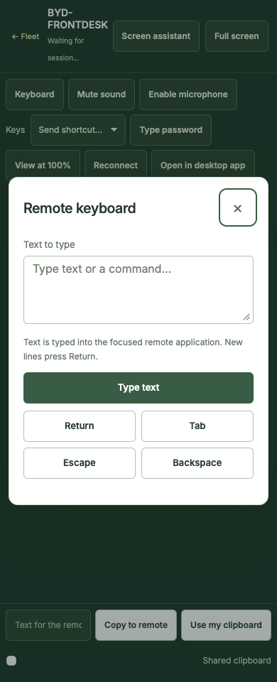

## Native iPad full-width masthead

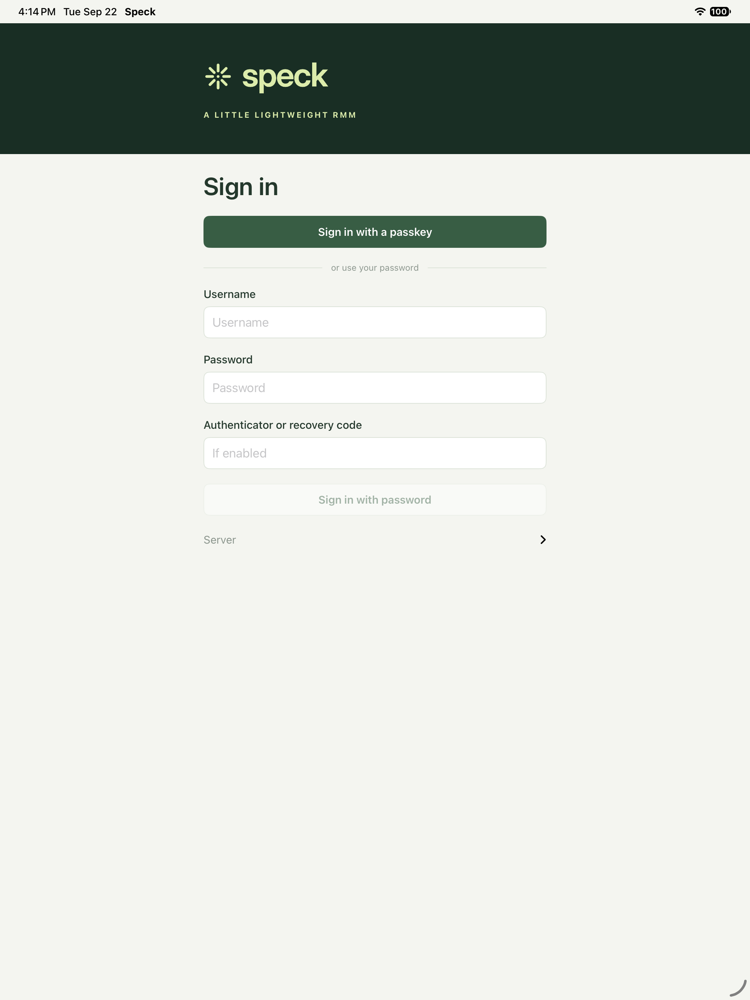

## Native iPhone sign-in

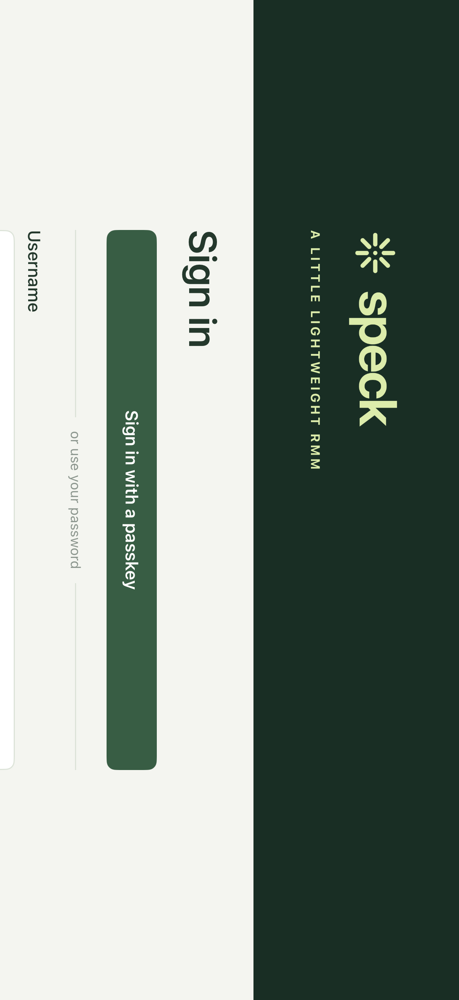

## Native machine actions and text-only metrics

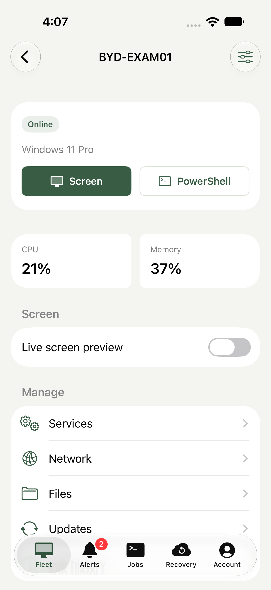

## Native accessibility text sizing

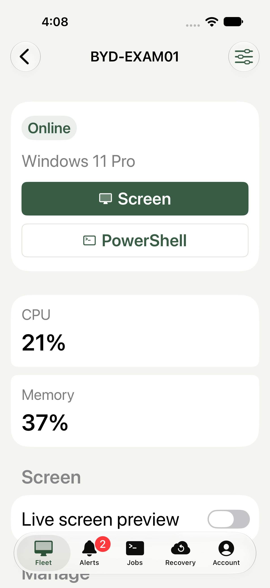

## Native dark appearance

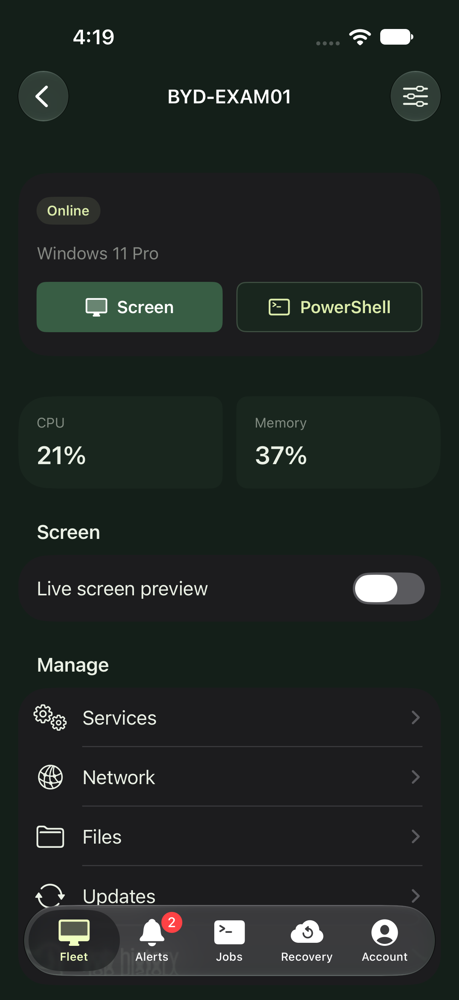
