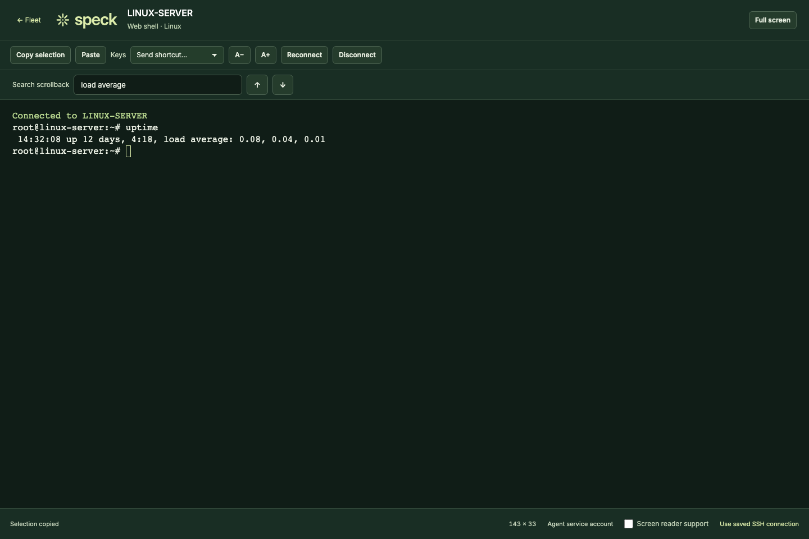
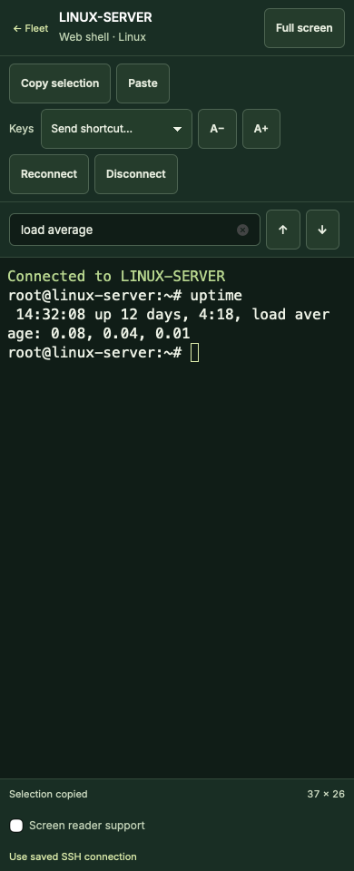

# Headless web shell

September 22, 2026. Unretouched captures from the real built frontend on
`codex/headless-webshell`. Inventory, terminal output and WebSocket traffic are
synthetic Playwright fixtures; these are layout evidence, not a live deployment.

| Desktop · Chromium · 1440 × 960 | Mobile · WebKit · 390 × 960 |
| --- | --- |
|  |  |

Reproduce with `npm run build --prefix web` followed by
`npm run test:ui --prefix web -- web-shell.spec.mjs`. Original captures are under
`output/headless-webshell/`. SHA-256 hashes are in `manifest.json`.

See [behavior, validation and release order](../../operations/web-shell.md).
